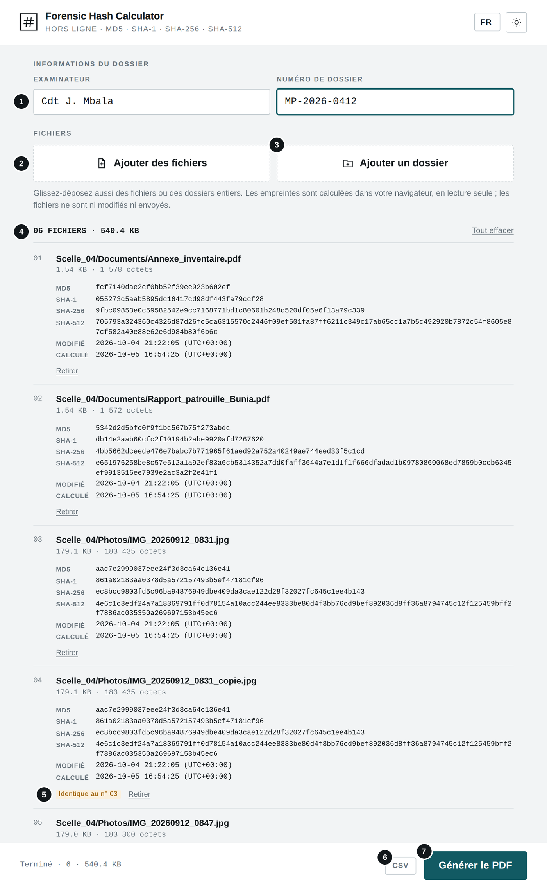
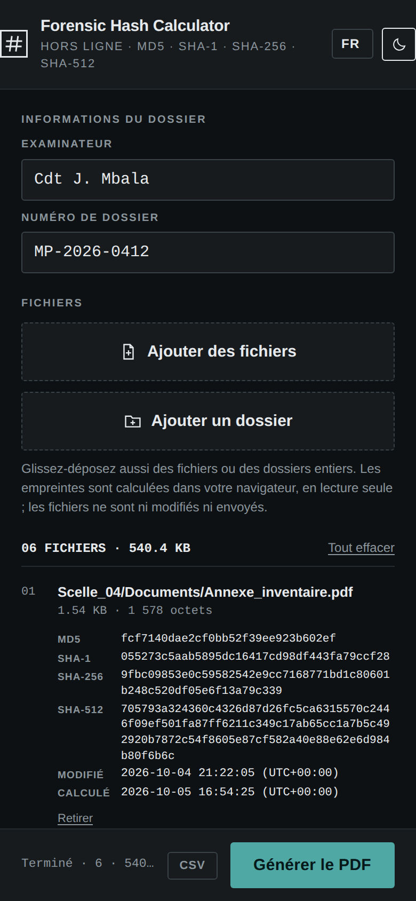
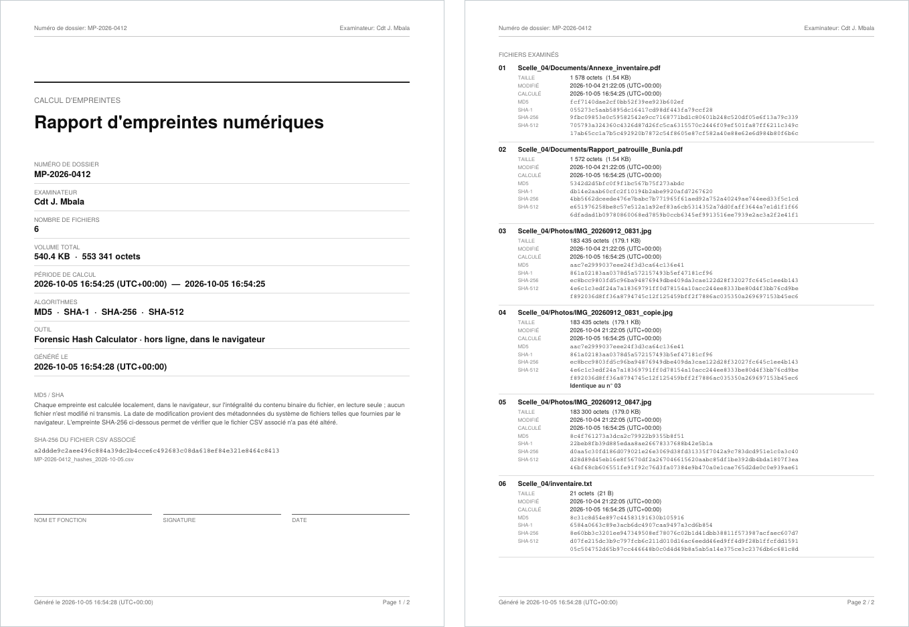
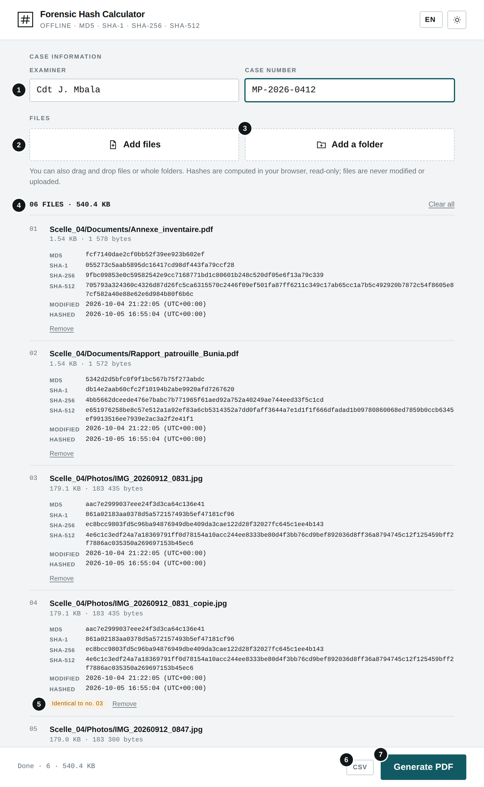
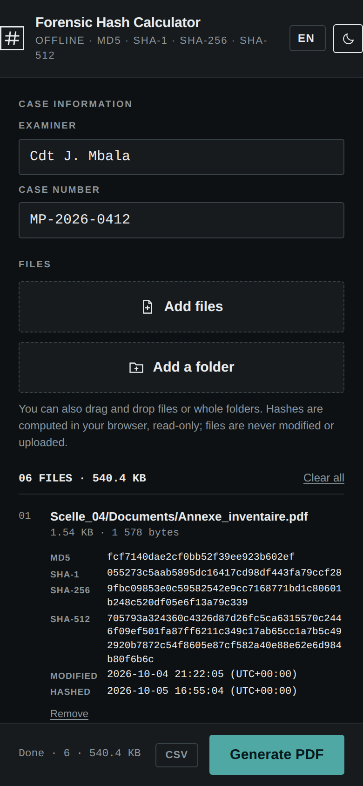
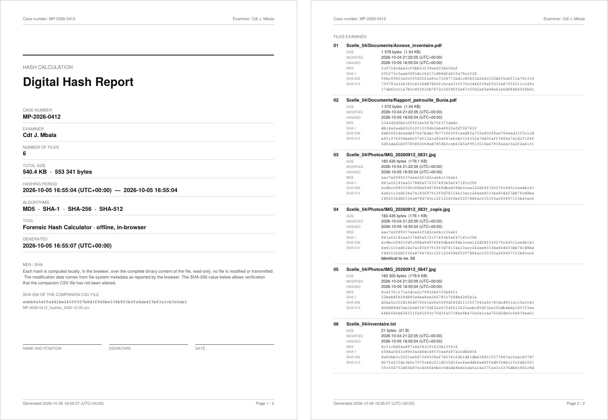

# Forensic Hash Calculator

**`FORENSIC_HASH_CALCULATOR.html`** · Hors ligne · Aucune installation · Aucun envoi — *Offline · No install · No upload*

**[Français](#français) · [English](#english)**

---

## Français

### À quoi sert cet outil

Cet outil calcule les empreintes numériques MD5, SHA-1, SHA-256 et SHA-512 de fichiers ou de dossiers entiers, et produit un rapport PDF à signer ainsi qu'un fichier CSV. Une empreinte identifie le contenu exact d'un fichier : la moindre modification la change. Elle permet de prouver l'intégrité d'une pièce numérique entre sa saisie et sa présentation.

### Avant de commencer

- Ouvrez le fichier FORENSIC_HASH_CALCULATOR.html par double-clic : il s'affiche dans votre navigateur (Chrome, Edge, Firefox ou Safari récents). Aucune installation n'est nécessaire.
- L'outil fonctionne sans connexion Internet. Aucun fichier n'est envoyé : tout le traitement se fait sur votre appareil.
- La langue (FR, EN, SW, LN) se choisit en haut à droite ; le bouton voisin bascule entre thème clair et sombre. Ces choix sont mémorisés.

### L'écran en un coup d'œil

1. Examinateur et numéro de dossier, repris dans le rapport
2. Ajouter des fichiers
3. Ajouter un dossier (sous-dossiers inclus)
4. Nombre de fichiers et volume total
5. Doublon : contenu identique à un autre fichier
6. Exporter le CSV
7. Générer le PDF

#### Sur téléphone (thème sombre)

### Utilisation pas à pas

1. Saisissez l'examinateur et le numéro de dossier.
2. Ajoutez les pièces avec « Ajouter des fichiers », « Ajouter un dossier », ou par glisser-déposer n'importe où dans la page. Le chemin complet de chaque fichier est conservé ; un même fichier n'est pas ajouté deux fois.
3. Le calcul démarre automatiquement (environ une minute par Go). La barre du bas affiche le fichier en cours, l'avancement et le débit.
4. Lorsque « Terminé » s'affiche, cliquez sur « CSV », puis sur « Générer le PDF ».
5. Imprimez le rapport, complétez nom et fonction, signez et datez la page de garde. Joignez-le au dossier avec le CSV.

> Lien entre le PDF et le CSV : la page de garde imprime l'empreinte SHA-256 du fichier CSV. Pour qu'elles correspondent, exportez le CSV et le PDF à partir de la même liste, sans modifier l'examinateur ni le numéro de dossier entre les deux. Toute modification ultérieure du CSV devient détectable.

### Résultat

*Le rapport : page de garde (dossier, volume, période de calcul, empreinte du CSV, cadre de signature), puis une fiche par fichier avec ses quatre empreintes.*

### Bonnes pratiques

- Calculez les empreintes le plus tôt possible après la saisie, idéalement sur le support d'origine en lecture seule.
- Pour vérifier une pièce plus tard, ajoutez à nouveau le fichier et comparez son SHA-256 avec celui du rapport : une valeur identique prouve un contenu identique. MD5 et SHA-1 sont fournis pour la compatibilité avec d'anciens outils.
- La date « Modifié » provient du système de fichiers et peut changer lors d'une copie : ce n'est pas la date de création.
- Les noms de fichiers en écriture non latine apparaissent avec « ? » dans le PDF ; ils sont exacts dans le CSV.

### En cas de problème

| Problème | Solution |
|---|---|
| **« Lecture impossible »** | Le fichier a été déplacé, verrouillé ou supprimé pendant le calcul, ou le support a été débranché. Retirez-le et ajoutez-le à nouveau. |
| **Bouton « Ajouter un dossier » absent** | Navigateur mobile : utilisez un ordinateur, ou le glisser-déposer. |
| **L'empreinte du CSV ne correspond pas à celle du PDF** | Le CSV a été exporté avec d'autres informations ou modifié. Exportez à nouveau le CSV et le PDF ensemble. |

### Confidentialité

L'outil fonctionne entièrement sur votre appareil, sans connexion Internet. Aucune donnée n'est transmise ni conservée en dehors des fichiers que vous téléchargez vous-même.

---

## English

### What this tool is for

This tool computes MD5, SHA-1, SHA-256 and SHA-512 hashes of files or entire folders, and produces a PDF report for signature plus a CSV file. A hash identifies the exact content of a file: the slightest change alters it. It proves the integrity of digital evidence between seizure and presentation.

### Before you start

- Double-click FORENSIC_HASH_CALCULATOR.html: it opens in your browser (recent Chrome, Edge, Firefox or Safari). Nothing to install.
- The tool works without an Internet connection. No file is uploaded: everything is processed on your device.
- Choose the language (FR, EN, SW, LN) at the top right; the button next to it switches between light and dark theme. Both choices are remembered.

### The screen at a glance

1. Examiner and case number, repeated in the report
2. Add files
3. Add a folder (subfolders included)
4. Number of files and total size
5. Duplicate: same content as another file
6. Export CSV
7. Generate PDF

#### On a phone (dark theme)

### Step by step

1. Enter the examiner and the case number.
2. Add the evidence with “Add files”, “Add a folder”, or by dragging and dropping anywhere on the page. Each file's full path is kept; the same file is never added twice.
3. Hashing starts automatically (about one minute per GB). The bottom bar shows the current file, progress and speed.
4. When “Done” appears, click “CSV”, then “Generate PDF”.
5. Print the report, fill in name and position, then sign and date the cover page. File it with the CSV.

> Link between the PDF and the CSV: the cover page prints the SHA-256 hash of the CSV file. For them to match, export the CSV and the PDF from the same list, without changing the examiner or case number in between. Any later change to the CSV becomes detectable.

### Result

*The report: cover page (case, volume, hashing period, CSV hash, signature block), then one entry per file with its four hashes.*

### Good practice

- Compute hashes as soon as possible after seizure, ideally on the original media in read-only mode.
- To check an exhibit later, add the file again and compare its SHA-256 with the report: an identical value proves identical content. MD5 and SHA-1 are provided for compatibility with older tools.
- The “Modified” date comes from the file system and can change when copying: it is not the creation date.
- File names in non-Latin scripts show as “?” in the PDF; they are exact in the CSV.

### Troubleshooting

| Problem | Solution |
|---|---|
| **“Could not read”** | The file was moved, locked or deleted during hashing, or the media was unplugged. Remove it and add it again. |
| **“Add a folder” button missing** | Mobile browser: use a computer, or drag and drop. |
| **The CSV hash does not match the PDF** | The CSV was exported with different details or was modified. Export the CSV and the PDF again together. |

### Privacy

The tool runs entirely on your device, without an Internet connection. No data is sent or kept anywhere other than the files you download yourself.
